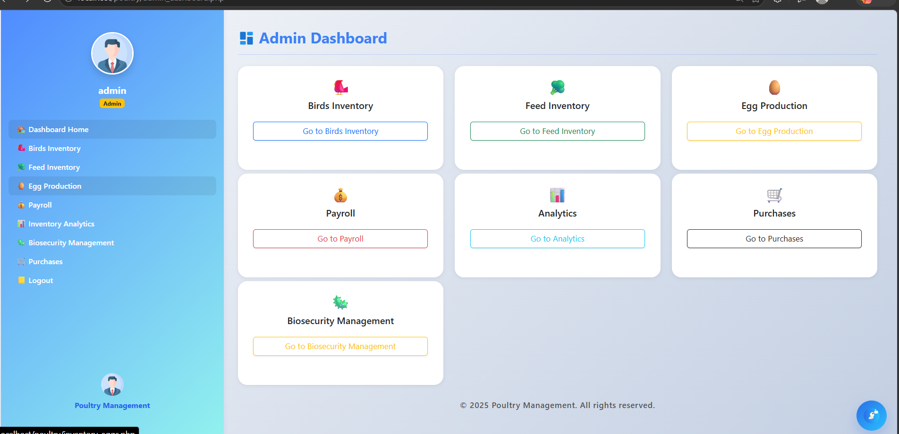
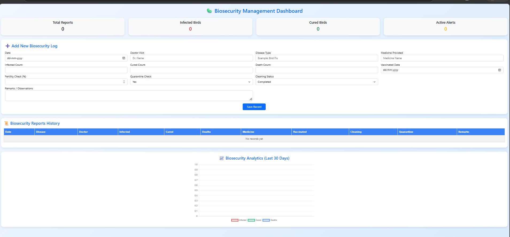
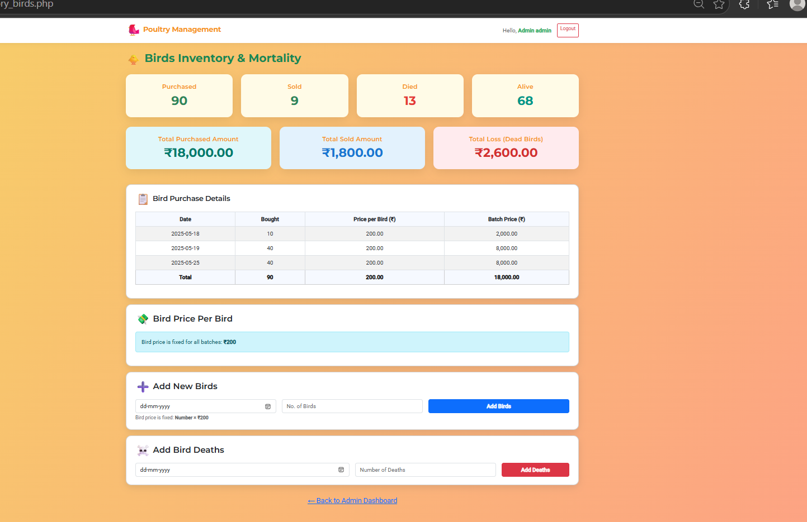
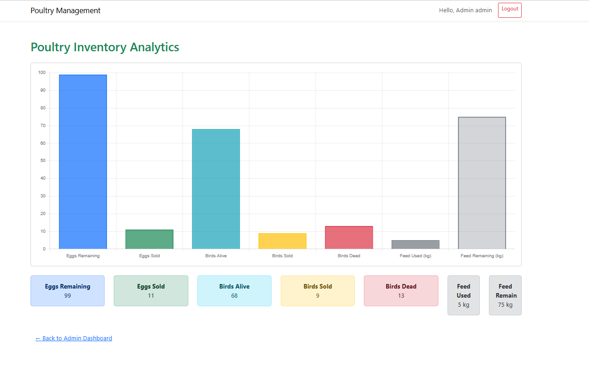
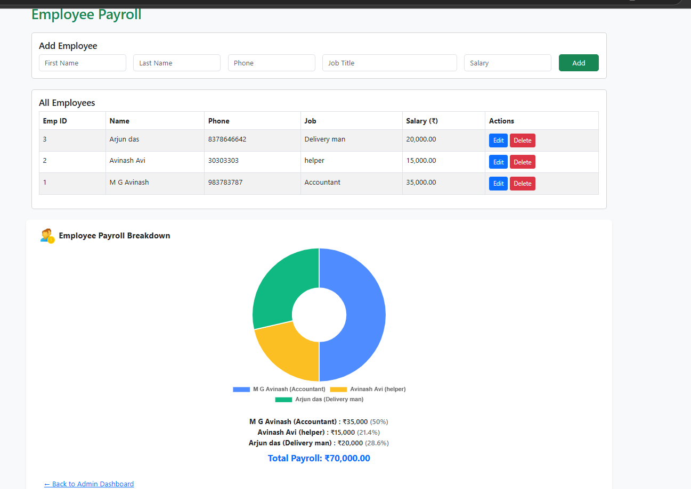
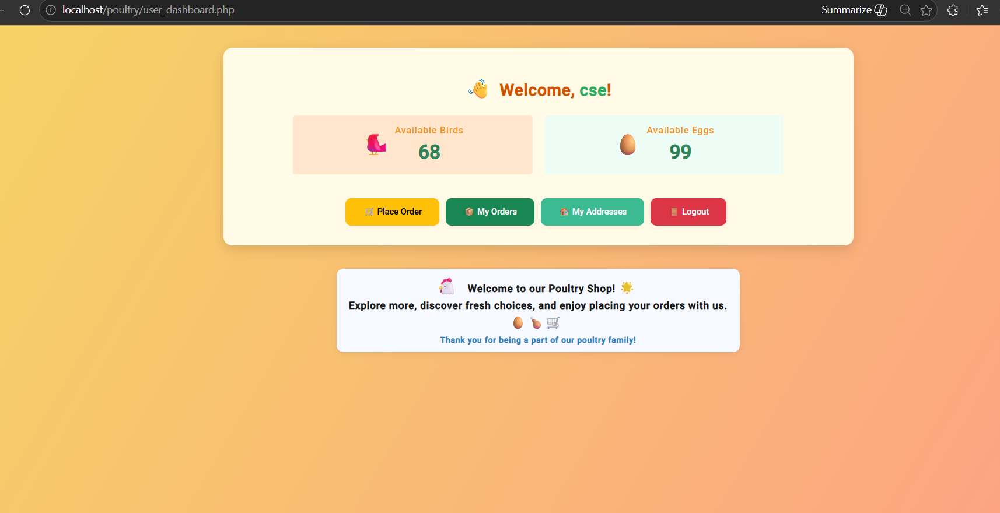

# 🐔 Poultry Management System

## Overview

A full-stack web application that digitizes poultry farm operations by combining inventory management, biosecurity tracking, payroll, analytics, and direct customer ordering in a single platform.

Designed to reduce manual work, improve accuracy, and enable data-driven decisions for poultry farm owners.

---

## 🚀 Key Features

### 🔐 Admin Panel

* Central dashboard for end-to-end farm control
* Inventory management:

  * Eggs, birds, and feed tracking
* 📊 Analytics with charts for production & trends
* 💰 Payroll management with salary insights
* 🛡️ Biosecurity:

  * Disease logs, vaccination, quarantine
* 🧾 Purchase & expense tracking

### 👤 User Panel

* Secure login & registration
* Browse products (eggs, birds)
* Order by **quantity or weight (kg)**
* Manage orders and addresses

---

## 🧩 Core Modules

* Inventory (Eggs, Birds, Feed)
* Biosecurity Management
* Payroll System
* Analytics Dashboard
* Order Management
* Authentication (Admin & User)

---

## 🛠️ Tech Stack

* **Frontend:** HTML, CSS, JavaScript (Vite/React UI)
* **Backend:** PHP
* **Database:** MySQL
* **Server:** XAMPP

---

## 📁 Project Structure

```id="tree2"
poultry-management-system/
│
├── admin/                 # Admin dashboards & operations
├── auth/                  # Login, register, logout
├── inventory/             # Eggs, birds, feed modules
├── user/                  # User dashboard & orders
├── database/              # DB schema
│   └── schema.sql
├── includes/              # Config, DB connection
├── poultry-ui/            # Frontend (Vite/React)
├── assets/
│   └── screenshots/       # UI images
├── tools/                 # Utilities/configs
└── README.md
```

---

## ⚙️ Setup Instructions

1. Clone:

   ```bash
   git clone https://github.com/your-username/poultry-management-system.git
   ```

2. Move to:

   ```
   C:\xampp\htdocs\
   ```

3. Start XAMPP (Apache + MySQL)

4. Create DB:

   ```
   poultry_management
   ```

5. Import:

   ```
   database/schema.sql
   ```

6. Run:

   ```
   http://localhost/POULTRY
   ```

---

## 📸 Screenshots

### 📋 Admin Dashboard



### 🛡️ Biosecurity



### 🐔 Inventory



### 📊 Analytics



### 💰 Payroll



### 👤 User Panel



---

## 🧠 Business Impact

* Eliminates manual record-keeping
* Improves accuracy & operational efficiency
* Enables real-time monitoring & insights
* Strengthens biosecurity practices
* Supports direct farm-to-customer sales

---

## 🔐 Security

* Sensitive keys are excluded via `.gitignore`
* Configuration centralized for safe access
* API keys are not stored in version control

---

## 🔮 Future Enhancements

* Online payment integration
* Mobile app support
* AI-based demand prediction
* Alerts & notification system

---

## 👨‍💻 Author

**M G Avinash**
Computer Science Engineering Student

---

## 📌 Summary

This project demonstrates full-stack development, modular architecture, database design, and solving a real-world agricultural use case with measurable business value.
